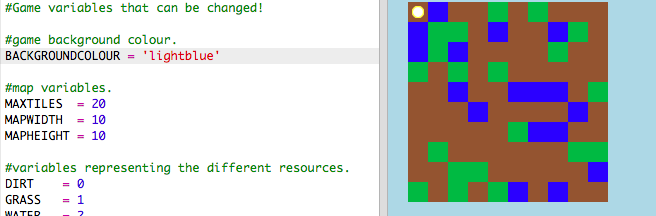

## 客製化您的遊戲

讓我們來修改一些變數改變遊戲的運作方式。

+ 點擊 `variables.py` 檔案來尋找可以改變的一些變數。
    
    

+ 更改 `BACKGROUNDCOLOUR` 變數的值，然後點擊“Run”來查看對遊戲的變動。
    
    

+ 變數 `MAXTILES` 是您的儲存庫中可以存放的每種資源的數量。 如果要儲存每個資源多於（或少於）20個，請更改此變數。
    
    