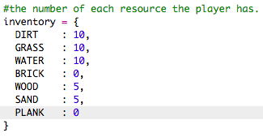

## 用木材製作木板

讓我們創建一個用木材製作的新木板資源。

+ 首先，在遊戲中添加一個新的 `PLANK` 變數。
    
    

+ 在遊戲中添加一個新的 `PLANK` 變數。
    
    

+ 將此資源命名為 `'plank'`。
    
    

+ 為您的 `PLANK` 資源提供圖像。 該專案已包含 `plank.gif` 圖像檔案，但如果您願意，可以創建自己的圖像。
    
    

+ 將木板添加到您的儲存庫中。
    
    

+ 設置放置木板的數字鍵。
    
    

+ 由於這種木頭資源可以被製作，您需要創建一個製作規則，即木板可以由3個木材資源制成。 將此程式碼添加到 `crafting` 字典。
    
    

+ 最後，您需要設置一個用於製作新木板的按鍵。
    
    

+ 要測試你的新木板資源，收集一些木材，然後用木材製作一些木板。 接著，您就可以將新木板放在您的世界中。
    
    